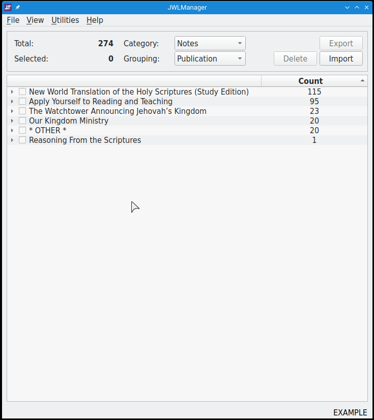
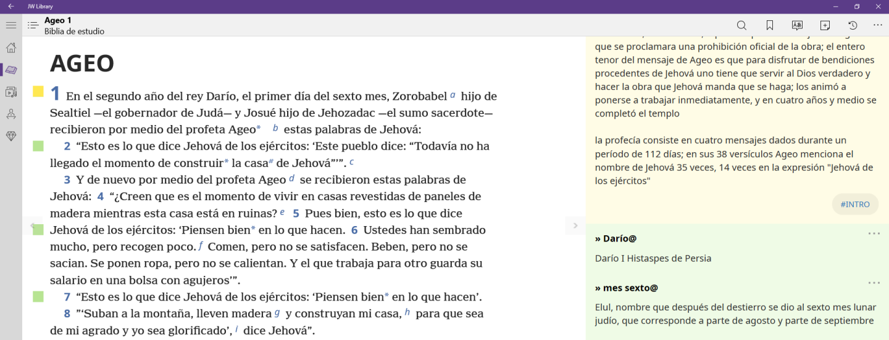

# JWLManager - v2[^#]
**Looking for help with translation on [Weblate](https://hosted.weblate.org/engage/jwlmanager/)**[^*]   

## Purpose

This is a **multi-platform application** for viewing and performing various operations on the *user* data stored in a *.jwlibrary* backup archive (created from within the **JW Library** app[^1]: Personal Study > Backup and Restore > Create a backup). A modified *.jwlibrary* archive can then be restored within the app.

In addition to the main functions of **viewing, exporting, importing, and deleting**, the application can also clean up any residual/unused records from the database and re-index the various tables within the database. Items from different backups can be **merged** by exporting the desired items and importing them into an existent archive or into a new one.



____
## Usage

### [Windows and Mac OS](https://github.com/erykjj/jwlmanager/releases)

Simply launch the **Windows executable** or **macOS app** as usual. If you receive **Windows Defender "unknown publisher" alerts**, you can safely choose "More info" and "Run anyway". See [here](https://github.com/erykjj/jwlmanager/issues/1) for a discussion on what's going on.

### Linux

Execute to run (from inside JWLManager folder):

```
$ python3 JWLManager.py
```

Or, make it executable first and run directly:

```
$ chmod +x JWLManager.py
$ ./JWLManager.py
```

You *may* have to install some of the required libraries[^2]. Do [let me know](https://github.com/erykjj/jwlmanager/issues) if you have any difficulties ;-)

____
## Operation

Open a *.jwlibrary* backup archive to see the Annotations (the editable progress fields in some of the newer publications), Bookmarks, Favorites, Highlights, and Notes (**Category**) that are stored within it. These will be organized in a tree view, which you can group (**Grouping**) by either the publication, the language, and (depending on what you are currently viewing) you may also have the option to group by year, color or tag. **Drag-and-drop to open** also works.

Notes that are not associated with any publication (created directly in the Personal Study space), are listed as *\* OTHER \** and with *\* NO LANGUAGE \**. Notes that aren't tagged will be listed as *\* UN-TAGGED \**. And in the Detailed view, any publication with no additional information will show *\* BLANK \**.

The **status bar** shows the name of the currently opened archive. The **Count** column shows the number of items for each branch of the tree.

The items are initially **sorted** by decreasing count. Clicking on the column headers allows for sorting the tree as well; clicking the same header again reverses the sort.

#### View

The ***View*** menu has some additional options (also accessible directly via the key combination shortcut):

* **Expand All (Ctrl+E)** - expands the tree to make all levels visible
  * Note: **double-clicking** on an entry will expand (or collapse) all *its* sub-levels
* **Collapse All (Ctrl+C)** - collapse all levels
* **Select All (Ctrl+A)** - a quick way to select all entries
* **Unselect All (Ctrl+Z)** - unselect everything
* **Detailed (Ctrl+D)** - add more detail to the tree: book and chapter in the case of the Bibles, article title (if provided in the archive) in case of other publications; be aware that **this will slow down the tree construction and selections** - depending on the number of items, so... wait patiently
* **Grouped (Ctrl+G)** - when grouping by publication, this further classifies the publications by type (books, brochures, periodicals, etc.); Detailed and Grouped views are mutually exclusive
* **Title View** - change how publication titles are displayed
  * **Code** - publication code
  * **Short Title** - abbreviated title
  * **Full Title** - complete title

**Right-clicking** on a line in the Notes or Annotations categories will bring up a window with a preview of the selected items, provided there aren't too many. The ID of each note is provided for reference.

If you modify an archive and intend to use the results to re-import into JW Library, make sure to **save** it (with a new name). **KEEP A BACKUP** of your original *.jwlibrary* archive in case you need to restore after messing up ;-)

#### Add

For Favorites only. Used for adding a Bible translation to your favorites, since there is no direct way of doing that in the JW Library app itself. **Make sure the Bible translation you add exists in the selected language** (as strange things can happen if it does not). Let me know if a required language is missing from the drop-down selection.

#### Delete

Select the Category and the item(s) you wish to eliminate from the database. For example, you may want to remove highlighting you made in some older magazines, or bookmarks you never knew you had, or clear your favorites completely, etc.

#### Eport

This is most useful for Notes, as it exports notes from selected publications to a text file which you can edit directly (add, remove, modify) and later import into your archive (or share with someone else).

Exporting of Annotations and Highlights is also possible - not so much with a view of direct editing, but sharing/merging into another archive.

#### Import

You need to provide a text file (UTF-8 encoded) with the Notes, Highlights or Annotations to import. You can use the file produced by exporting. Or you can create your own. The Higlights file is a CSV text file with a **{HIGHLIGHTS}** header. The Annotations file is also a CSV file, starting with **{ANNOTATIONS}**. You can simply **drag-and-drop the import file** into the app.

Editing or creating a Highlights or Annotations import file is *not* recommended. Rather, exported Highlights or Annotations can be merged into another archive. Any conflicting/duplicate entries will be replaced. In the case of Highlights, *overlapping highlights will be combined and the color changed to the one being imported*.

The accepted format for the Notes import file is like this:
    
    {TITLE=»}
    ==={CAT=BIBLE}{LANG=1}{ED=Rbi8}{BK=1}{CH=1}{VER=1}{COLOR=1}{TAGS=}{DATE=2021-10-19}===
    » Title
    Multi-line...
    ...note
    ==={CAT=PUBLICATION}{LANG=1}{PUB=rsg17}{ISSUE=0}{DOC=1204075}{BLOCK=517}{COLOR=0}{TAGS=research}{DATE=}===
    » Title
    Multi-line...
    ...
    ...note
    ==={CAT=INDEPENDENT}{TAGS=personal}{DATE=2021-10-19}===
    » Title
    Multi-line...
    ...note
    ==={END}===

The **{TITLE=}** attribute in the first line is *required* to identify a Notes export/import file, and provides a convenient way to delete any notes that have titles starting with this character (in this case "»"). This is to avoid creating duplicate notes if the title has changed. When set, all notes with titles starting with this character will be deleted before notes from the import file are imported. Otherwise, *notes with same title at same location will be over-written*, but those where the title was modified even slightly will create an almost duplicate note. **Note**: this affects *all* notes - regardless of language or publication.

Each note definition starts with an attribute line. **{CAT=}** define the category. The **{LANG=}** attribute defines the language of the note (0 = English; 1 = Spanish; 2 = German; 3 = French; 4 = Italian; 5 = Brazilian Portuguese; 6 = Dutch; 7 = Japanese, etc.),  and **{ED=}** defines the Bible edition to associate the note with ("nwtsty" = Study Bible; "Rbi8" = Reference Bible) - **{PUB=}** for publications.

**Note**: unless the corresponding colored highlights are also imported, the imported notes are placed at the *beginning* of the paragraph or verse that they are attached to.

**Note**: if separated from their corresponding colored highlights, the note "stickies" appear in all Bibles *except* the Bible that is referenced at the bottom of the note in the "Personal Study" section, though the notes themselves are there in the reference pane (the default gray note icons do show correctly). The stickies *do* show in all the other Bibles. This may be a bug (or a feature?) in the app itself. For now, to have colored note icons (without any highlighting), I import my notes as for the Reference Bible (*Rbi8*); this way I can see the stickies in the Study Bible (*nwtsty*).



For Bible notes, **{BK=}{CH=}{VER=}** are all numeric and refer to the number of the book (1-66), the chapter and the verse, respectively. For books with just one chapter, use "1" for the chapter number. **{ISSUE=}{DOC=}{BLOCK=}** are the attributes associated with locations within a publication - they are, obviously, a bit more complicated to create, so it's best to simply modify the export file and re-import.

The **{COLOR=}** setting (0 = grey; 1 = yellow; 2 = green; 3 = blue; 4 = red; 5 = orange; 6 = purple) indicates the color of the note. The words themselves will not be highlighted; instead, there will be a colored sticky in the left margin next to the verse with the note.

**{TAGS=}** is used to add one or more tags to each note. If empty, no tag is added; if a note is replacing/updating another, its tags will be updated or removed.

**{DATE=}** is the date of last modification for each note in the format *yyyy-mm-dd*. If empty, and the note is new, the date of import is used; if the note is updated, the currently-set date is retained. Keep in mind that if you are using the option to first delete the notes with a special {TITLE=} character, the historical date will also need to be reimported.

Each note has to start with such a header. The very next line after the header is the note title. **Titles** will be automatically abbreviated with inner words being replaced with "[...]" in order to meet the length limit and display properly. A multi-line body follows, terminated by the header of the next note or the file-terminating header =\=={END}===.

Here is an example blue note for Jude 21 (in  Spanish):

    ==={CAT=BIBLE}{LANG=1}{ED=Rbi8}{BK=65}{CH=1}{VER=21}{COLOR=3}{TAGS=}{DATE=}===
    » para mantenerse en el amor de Dios
    1. _edificándonos sobre nuestra santísima fe_ mediante el **estudio** diligente de la Palabra de Dios y la participación en la obra de predicar
    2. _**orando** con espíritu santo_, o en armonía con su influencia
    3. ejerciendo **fe** en el sacrificio redentor de Jesucristo, que hace posible la _vida eterna_

On a side-note, I format my notes with Markdown syntax (as above) for, even though JW Library doesn't allow rich-text formatting in the notes, that may change in the future and it should then be realtively easy to convert.

#### UTILITIES

#### Obscure

If you need to share your complete archive but have some personal or confidential information, you can use this option to over-write text fields in your archive. The length of the text remains the same, leaving all numbers and punctuation in place, but replacing alphabetic characters with meaningless expressions such as 'obscured', 'yada', 'bla', 'gibberish' or 'børk'. To confirm: check the detailed view or right-click on a Notes item to see the preview. Only tags are not obscured.

#### Reindex

This function cleans up and re-orders the records in the archive database. It is not strictly required, though it *may* streamline and speed it up slightly. The process itself may take up to a minute, depending on the number of records the database contains. It does not need to be run more than once in a while.

____
## Feedback

Feel free to [get in touch](https://github.com/erykjj/jwlmanager/issues) and post any issues and suggestions.

[](https://github.com/erykjj/jwlmanager/releases.atom)

____
[^#]: This is the current (Qt6/PySide6-based) branch for newer operating systems (Linux, MS Windows 10/11, macOS 10.14 and up). For older systems, see the [v1 branch](https://github.com/erykjj/jwlmanager/tree/Qt5) (based on Qt5/PySide2).
[^*]: To start with: French, German, Italian and Portuguese. Chinese and Russian (and any other volunteers) also appreciated. Please contact me at the email in the *About...* box in the app.
[^1]: [JW Library](https://www.jw.org/en/online-help/jw-library/) is a registered trademark of *Watch Tower Bible and Tract Society of Pennsylvania*.
[^2]: `pip3 install filehash PySide6 regex`.
